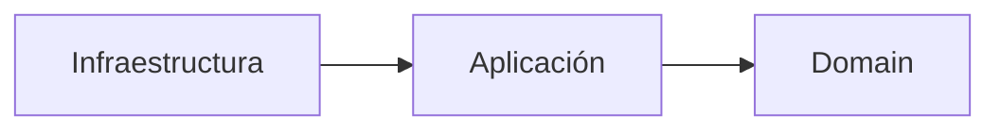
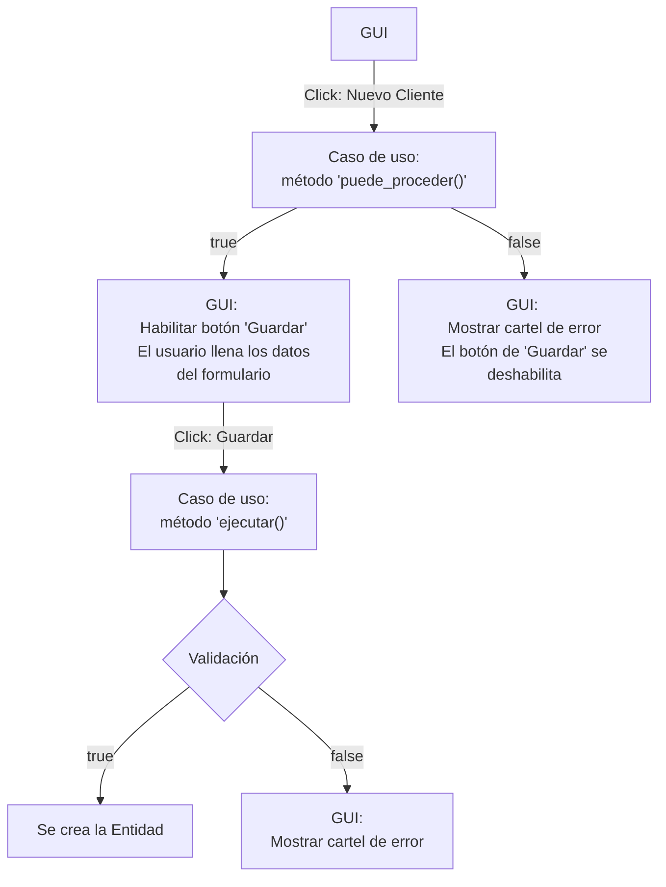
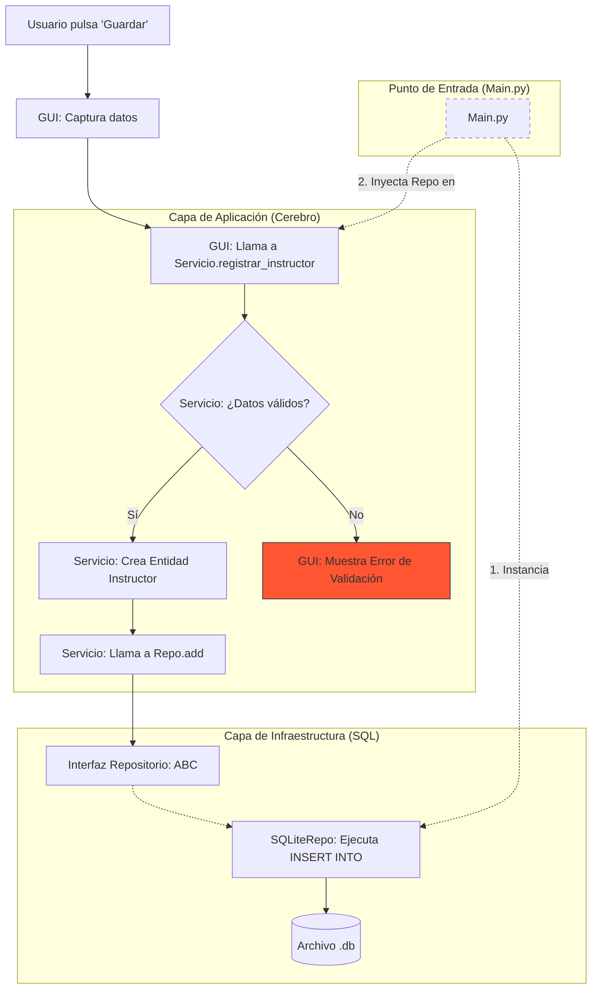

# 🏗️ Documentación: Arquitectura Limpia y DDD (Domain-Driven Design)

Este documento compendia la arquitectura de desarrollo de software, siguiendo los principios de **Clean Architecture** (arquitectura hexagonal), **SOLID**, **DDD (Domain-Driven Design)**.

Se irá explicando, detallando cada capa y su funcionalidad. Se hará todo siguiendo como ejemplo el proyecto del Gimnasio.

## 📚 0. Definiciones

- **Clean Architecture:** Arquitectura limpia, también conocida como arquitectura hexagonal, es un patrón de diseño que separa la lógica de negocio (domain) de la lógica de la interfaz de usuario (gui) y la lógica de la base de datos (infrastructure).

- **SOLID:** Principios de diseño de software que hacen que el código sea más mantenible y escalable.
Estos principios son:

    - **Single Responsibility Principle (SRP):** Un módulo debe tener una sola responsabilidad.
    - **Open/Closed Principle (OCP):** Un módulo debe estar abierto para extensión y cerrado para modificación.
    - **Liskov Substitution Principle (LSP):** Un módulo debe ser reemplazable por otro que cumpla con la misma interfaz.
    - **Interface Segregation Principle (ISP):** Un módulo debe tener interfaces pequeñas y específicas.
    - **Dependency Inversion Principle (DIP):** Un módulo debe depender de abstracciones y no de detalles concretos.

- **DDD (Domain-Driven Design):** Diseño centrado en el dominio, que busca que el código sea más fácil de entender y mantener. Esto se consigue creando una capa de dominio que contiene las reglas de negocio y las entidades puros.
    - **Domain (dominio):** Aquí van las dataclasses (Entidades) y las excepciones lógicas. No hay nada de Flask, Django o SQL aquí. Es código "puro".
    - **Application (aplicación):** Aquí van los Casos de Uso. Son clases que orquestan: "Llamo al repositorio, busco al cliente, le cambio la rutina y guardo".
    - **Infrastructure (infraestructura):** Aquí va el código "sucio": la conexión real a la DB, el envío de emails, la configuración de la API.
    - **Presentation (presentación):** Aquí van las vistas y la lógica de la GUI.

    ¿Por qué se hace así? Para que, si mañana se decide cambiar la base de datos de SQLite a MongoDB, solo se tenga que cambiar la carpeta /infrastructure. La "Lógica de Negocio" y las "Entidades" en /domain no se tocan. Están protegidas.

La regla de oro en Arquitectura Limpia es: Las dependencias siempre apuntan hacia adentro:
**Infraestructura -> Aplicación -> Dominio**



## 📂 1. Estructura de Proyecto (El Árbol Maestro)

La organización de archivos asegura que la lógica de negocio sea independiente de la tecnología (base de datos, GUI).


```plaintext
GimnasioApp/
│
├── main.py                 # El Ensamblador (Punto de entrada e Inyección de Dependencias)
├── config.py               # Configuración centralizada (Entornos y Debug)
├── .gitignore              # Ignora data/*.db y __pycache__
│
├── data/                   # PERSISTENCIA FÍSICA
│   └── gimnasio.db         # Archivo SQLite (No se sube a Git)
│
├── domain/                 # CAPA DE DOMINIO (El Corazón - Reglas de Negocio)
│   ├── __init__.py
│   ├── entities.py         # Modelos de datos puros (@dataclasses)
│   ├── interfaces.py       # Contratos/Clases Abstractas (Repositorios ABC)
│   └── exceptions.py       # Errores específicos del negocio (e.g. ClienteSinInstructorError)
│
├── application/            # CAPA DE APLICACIÓN (Casos de Uso - Orquestación)
│   ├── __init__.py
│   └── gym_service.py      # Orquestador de lógica (El "Cerebro") 
│                                            # Lógica de inscribir a alguien
│
├── infrastructure/         # CAPA DE INFRAESTRUCTURA (Detalles Técnicos)
│   ├── __init__.py
│   ├── sqlite_repo.py      # Implementación real de SQL
│   └── database_conn.py    # Gestión de conexión (Context Managers)
│
├── gui/                    # CAPA DE PRESENTACIÓN
│   ├── views.py            # Definición de la GUI (Interfaz de usuario)
│   ├── controllers.py      # Controladores de la GUI (Manejo de eventos)
│   ├── styles.py           # Definición de colores y temas (clases de estilo)
│   └── assets/             # RECURSOS ESTÁTICOS
│       ├── icons/          # Archivos .ico, .png, .svg
│       │   └── logo.ico
│       ├── fonts/          # Archivos .ttf o .otf
│       │   └── Roboto-Regular.ttf
│       ├── images/         # Fotos o banners
│       └── themes/         # Archivos .json o .xml de configuración visual
│
└── tests/                  # Carpeta para pruebas unitarias (Muy recomendada)
    ├── test_domain.py
    └── test_services.py
```

## 🏛️ 2. Definición de Capas y Responsabilidades

| Capa | Definición | Responsabilidad |
| :--- | :--- | :--- |
| **Domain** | El "Qué" | Define las `entidades` puras (Instructor, Rutina, Cliente) que son datos con identidad, sin métodos, por tanto suelen ser `@dataclass`, no ABC ya que son concretas; y las `interfaces` de lo que el sistema debe hacer. Estas interfaces, llamadas en DDD como "contratos", son las que definen 'qué' se debe hacer (guardar, buscar, eliminar, etc), pero no el 'cómo'. Vienen a ser la capa de Repositorios (Principio de Inversión de Dependencias) y son abstractas, estas si tienen los `@abstractmethod` que definen los métodos que deben implementar las clases concretas. Luego se 'hacen' en Infrastructure. **0 dependencias externas**. Es el núcleo de tu negocio. Si mañana decides dejar de ser un gimnasio y pasar a ser una escuela, esta es la única carpeta que borrarías por completo.|
| **Application** | El "Cómo funciona" | Casos de uso. Coordina el flujo (ej: "Para matricular un cliente, valida que exista el instructor y luego guarda"). La GUI llamará a estos métodos. No sabe nada de SQL, solo usa el repositorio que le den. `Services`: Aquí vive la lógica que coordina. Por ejemplo: "Para registrar un cliente, primero busca si el instructor existe, luego verifica la rutina y, si todo está bien, guárdalo".|
| **Infrastructure**| El "Con qué tecnología" | Implementaciones técnicas. Aquí vive el SQL de SQLite o llamadas a APIs. Aquí se implementan las interfaces de la capa de dominio, como por ejemplo, heredando de la clase abstracta Repositorio(ABC). Repositories: Las implementaciones reales (SQLite, PostgreSQL, Firestore). |
| **Presentation** | El "Quién" | La GUI. Captura clics y muestra datos. No sabe que existe una base de datos. |
| **Main (Raíz)** | El Mecánico | Une las piezas. Inyecta la infraestructura real en el servicio y el servicio en la GUI. |

---
Flujo de Ejecución:

1. GUI: El usuario hace clic en "Guardar Cliente". La GUI recolecta los IDs del Instructor y la Rutina seleccionados.

2. SERVICIO: La GUI llama a servicio. Capa: Aplicación.

3. LÓGICA (Dentro del Servicio): Capa: Aplicación.

   * El servicio usa el `InstructorRepository` (repositorio en interfaces.py) para buscar si el instructor existe.
   * Usa el RutinaRepository (repositorio en interfaces.py) para buscar la rutina.
   * Si ambos existen, crea la Entidad Cliente.
   * Finalmente, llama al ClienteRepository (repositorio en interfaces.py) para guardarlo en la DB.

4. INFRAESTRUCTURA: El repositorio de SQLite recibe la entidad y ejecuta el INSERT INTO.

5. GUI: La GUI muestra un mensaje de éxito o error.

|Capa|Responsabilidad|Conoce a...|
|---|---|---|
|GUI|Mostrar datos y captar clics.|Capa de Aplicación (Servicios).|
|Aplicación|Lógica de negocio y coordinación.|Entidades e Interfaces de Repositorio.|
|Infraestructura|"Detalles técnicos (SQLite, Archivos, APIs)."|Entidades e Interfaces (para implementarlas).|
|Entidades|Datos puros del gimnasio.|Nadie (es el centro).|

## 3. Ejemplo de todo el conjunto incluyendo la inyección de dependencias de main.py

```python
# --- CAPA DE ENTIDADES ---
@dataclass
class Rutina:
    id: Optional[int]
    nombre: str

# --- CAPA DE REPOSITORIOS (INTERFACES) ---
class RutinaRepository(ABC):
    @abstractmethod
    def add(self, rutina: Rutina): pass

# --- CAPA DE INFRAESTRUCTURA (IMPLEMENTACIONES REALES) ---
class SQLiteRutinaRepository(RutinaRepository):
    def add(self, rutina: Rutina):
        print("💾 Guardando en SQLite: " + rutina.nombre)

class CloudRutinaRepository(RutinaRepository):
    def add(self, rutina: Rutina):
        print("☁️ Subiendo a la Nube (API): " + rutina.nombre)

# --- CAPA DE APLICACIÓN (EL SERVICIO) ---
class RutinaService:
    # Aquí es donde ocurre la magia: el servicio solo pide "un repositorio"
    def __init__(self, repo: RutinaRepository):
        self.repo = repo  

    def crear_rutina(self, nombre: str):
        nueva = Rutina(id=None, nombre=nombre)
        # El servicio ejecuta .add() sin saber si es SQLite o Nube
        self.repo.add(nueva)

# ==========================================
# EL "SWITCHEO" (MAIN.PY)
# ==========================================

# Aquí es donde se decide la tecnología
entorno = "PRODUCCION" 

if entorno == "PRODUCCION":
    infra_real = CloudRutinaRepository()
else:
    infra_real = SQLiteRutinaRepository()

# Aquí es donde el Servicio recibe la especificación tecnológica
servicio = RutinaService(repo=infra_real) 

# La GUI solo usará el servicio
servicio.crear_rutina("Pierna y Glúteo")
```

### ¿Dónde ocurrió la entrega de la tecnología?
Ocurrió en esta línea: 

```python
servicio = RutinaService(repo=infra_real)
```

En la definición del Servicio: Tú escribiste repo: `RutinaRepository`. Eso es como decir: "Acepto cualquier objeto que cumpla con la forma de un Repositorio".

En la ejecución (Main): Le pasaste `infra_real` (que es un `CloudRutinaRepository`).

### ¿Por qué esto es SOLID?
Cumples con el Principio de Inversión de Dependencias (la D de SOLID):

Los módulos de alto nivel (Servicio) no deben depender de módulos de bajo nivel (SQLite). Ambos deben depender de abstracciones (Interfaz Repositorio).

Las abstracciones no deben depender de los detalles. Los detalles (SQLite) deben depender de las abstracciones.

### ¿Cómo se ve dentro del archivo de la GUI?
Para que la GUI pueda usar el servicio, su clase tiene que estar preparada para recibirlo. Mira cómo sería el archivo gui/views.py:

```python
# gui/views.py

class GymGUI:
    def __init__(self, servicio):
        # Aquí es donde el servicio llega al archivo de la GUI
        self.servicio_gym = servicio 
        
    def boton_guardar_click(self):
        # La GUI usa el servicio que recibió al nacer
        nombre = self.entrada_texto.get()
        self.servicio_gym.crear_rutina(nombre)
```

### ¿Por qué esto es brillante? (El secreto de la arquitectura)
Si te fijas bien en el archivo de la GUI:

* NO hay un import sqlite3.
* NO hay un import infrastructure.

La GUI es "ciega": No sabe si los datos van a un archivo de texto, a una base de datos en Marte o a una lista en memoria. Solo sabe que tiene un objeto llamado `servicio_gym` que tiene un método `.crear_rutina()`. 

### Resumen del flujo de la variable:
* Infra se crea en main.py.
* Infra se mete dentro de Servicio (en main.py).
* Servicio (con la infra dentro) se mete dentro de GUI (en main.py).
* La GUI simplemente lo guarda en self.servicio y lo usa cuando el usuario hace clic

La GUI no sabe qué servicio es, qué tecnología usas (SQL, Nube, etc.) ni cómo es el objeto `servicio_gym`, solo sabe que tiene un método `.crear_rutina()` cuando el usuario hace clic en crear rutina, el servicio ejecuta la infra que le corresponde y la GUI jamás supo ni sabrá qué sucedió.

### Inyección: 
Al pasar la variable servicio como argumento al constructor de la GUI, le estás dando una "referencia" o un "puntero". No estás moviendo el código, solo le estás diciendo a la GUI: "Usa este objeto que ya tengo aquí".

### Aislamiento: 
Gracias a esto, tus archivos de gui/views.py, services.py e infrastructures.py pueden ser probados por separado, porque ninguno de ellos "manda" sobre el otro; todos obedecen al ensamblaje que hiciste en main.py. Por ello, puedes hacer testing insertando un repositorio en memoria (que no guarde nada en la base de datos) y probar que el servicio funcione correctamente, simulando que recibe un repositorio real y viendo cómo reacciona.

### Todo esto ocurre en la misma "habitación" (main.py)

```python
repo = RepositorioSQL()          # Pieza A
serv = GimnasioService(repo)     # Pieza B (usa A)
ventana = MiGUI(serv)            # Pieza C (usa B)

ventana.iniciar()                # Se enciende la máquina
```

El main.py (o el punto de entrada) en DDD tiene una única misión: La Inyección de Dependencias. Su trabajo es:

1. Instanciar la base de datos (Infraestructura).
2. Instanciar los Repositorios.
3. Instanciar los Casos de Uso pasándole esos repositorios.
4. Arrancar la aplicación.

#### Pre-Condición
1. Al abrir la ventana de "Nuevo Cliente", o cualquier otra, tras hacer click en el botón: La GUI llama al método puede_proceder() (o similar) del Caso de Uso.
2. Si devuelve False: La GUI muestra un cartel: "Error: Debes cargar instructores primero". El botón de "Guardar" se deshabilita.
3. Si devuelve True: El usuario llena los datos.
4. Al dar Click en Guardar: Se llama a ejecutar(). Aquí se vuelve a validar (por seguridad) y se crea la Entidad.


### La GUI usa el ESTADO el cuál usa el SERVICIO el cuál usa la INFRAESTRUCTURA la cuál está diseñada conforme la INTERFAZ que formaliza la manipulación de las ENTIDADES

#### La Cadena de Mando (de afuera hacia adentro)
1. **GUI** (`@ft.component`): El usuario hace click en "Guardar". No sabe nada de bases de datos, solo sabe que debe avisarle al Estado.
2. **ESTADO** (`@ft.observable`): Recibe el aviso, pone un ícono de "cargando..." en la pantalla y le pasa los datos al Servicio. Su fin es que la GUI reaccione.
3. **SERVICIO** (`class` capa de Aplicación): El cerebro del negocio. Dice: "Antes de guardar, voy a verificar si este cliente ya existe o si el instructor tiene cupo". Si todo está bien, llama a la Infraestructura.
4. **INFRAESTRUCTURA** (`class SQLRepo`): El obrero. Sabe que tiene que abrir una conexión a SQLite o PostgreSQL y escribir un INSERT INTO.... Todo esto cumpliendo las reglas establecidas en la Interfaz.
5. **INTERFAZ** (`ABC`): El contrato legal. Asegura que la Infraestructura tenga los métodos (`@abstractmethod`) que el Servicio espera (como .add() o .get()). Sin esto, el Servicio no sabría cómo hablar con la Infraestructura.
6. **ENTIDADES** (`@dataclass`): El átomo del sistema. Es el Cliente con su nombre, apellido y DNI. Es lo que viaja a través de toda la cadena.

## ⚙️ 4. Componentes Técnicos Clave

### A. Inversión de Dependencias (DI)
El concepto clave es el **"Efecto Matrioshka"**:
1. En `main.py` se crea la `Infraestructura` (el "cómo" técnico). O sea hacemos una instancia del repositorio SQLite (o la teconogía que se escoja, siempre y cuando herede de la clase abstracta Repositorio(ABC)).
2. Se inyecta la `Infra` creada en el `Servicio` (el "cerebro").
3. Se inyecta el `Servicio` creado en la `GUI` (la "cáscara").

Esto permite que si cambias de SQLite a PostgreSQL, **solo modifiques una línea en `main.py`**.

### B. Gestión de Conexiones (`@contextmanager`)
Se utiliza para asegurar que la base de datos se abra y cierre correctamente, incluso si hay errores.
**Flujo de ejecución:**
1. **Preludio (Antes del `yield`):** Se abre la conexión y se inicia la transacción. Esto es debido al `with` que se usa en el repositorio. Esto invoca a get_connection() que es el que abre la conexión.
2. **Yield:** El código se "congela" al llegar al `yield` y cede el control al bloque `with` del repositorio para ejecutar el SQL (todo lo que está luego del `:` del `with`).
3. **Epílogo (Después del `yield`):** Al terminar el bloque `with`, continúa la ejecución (lo que sigue al `yield`) y se ejecuta `commit()` si todo salió bien, o `rollback()` si hubo un error. Y **siempre** se ejecuta `close()`, salga bien o salga mal el `commit()`.

Sin el `@contextmanager`, se tendría que escribir try/except/finally en cada método de todos los repositorios. ¡Un desastre de repetición!

#### El "Superpoder" que otorga el decorador
Por naturaleza, la sentencia with solo funciona con objetos que tienen dos métodos especiales: `__enter__` (qué hacer al empezar) y `__exit__` (qué hacer al terminar).

Escribir esos métodos a mano es tedioso. El decorador `@contextmanager` hace ese trabajo sucio por ti:
* Todo lo que esté antes del `yield` lo mete automáticamente en el `__enter__`.
* Todo lo que esté después del `yield` lo mete en el `__exit__`.

```python
# infrastructure/database_conn.py
import sqlite3
from contextlib import contextmanager

class DatabaseConnection:
    def __init__(self, db_path: str):
        self.db_path = db_path

    @contextmanager
    def get_connection(self):
        """Gestiona la apertura y cierre automático de la conexión."""
        conn = sqlite3.connect(self.db_path)
        conn.row_factory = sqlite3.Row  # Permite acceder a columnas por nombre
        try:
            yield conn
            conn.commit()  # Guarda cambios automáticamente si no hay error
        except sqlite3.Error as e:
            conn.rollback() # Cancela cambios si algo sale mal
            raise e
        finally:
            conn.close()    # Se cierra siempre, pase lo que pase
```

#### ¿Cómo lo usa el Repositorio?
Ahora tu repositorio no tiene que preocuparse por cerrar conexiones ni hacer commits. Solo pide una conexión y la usa:

```python
# infrastructure/sqlite_repo.py
from .database_conn import DatabaseConnection

class SQLiteInstructorRepository:
    def __init__(self, db_conn: DatabaseConnection):
        self.db = db_conn

    def save(self, instructor):
        # Usamos el context manager que creamos
        with self.db.get_connection() as conn:
            query = "INSERT INTO instructores (nombre) VALUES (?)"
            conn.execute(query, (instructor.nombre,))
            # ¡No hace falta cerrar la conexión ni hacer commit! 
            # El context manager lo hace por nosotros al salir del bloque 'with'.
```

#### Ventajas de esta separación:
1. *Manejo de Transacciones:* Si el repositorio intenta guardar tres cosas y la segunda falla, el `rollback()` en `database_conn.py` asegura que no se guarde nada a medias (mantiene la integridad).

2. *Row Factory:* Al configurar `sqlite3.Row`, los resultados de la DB se pueden leer como diccionarios (fila["nombre"]) en lugar de tuplas aburridas (fila[0]), lo que hace tu código mucho más legible.

3. *Punto Único de Fallo:* Si decides cambiar cómo te conectas (por ejemplo, activar las claves foráneas en SQLite: `PRAGMA foreign_keys = ON;`), solo lo escribes en este archivo y afecta a toda la aplicación.

#### El flujo en main.py
Ahora el ensamble se vuelve un poco más sofisticado:

```python
# main.py
db_manager = DatabaseConnection(Config.DB_NAME) # 1. Creamos el gestor de conexión
repo = SQLiteInstructorRepository(db_manager)  # 2. Se lo pasamos al repo
servicio = GymService(repo)                     # 3. El repo al servicio
```

### C. Modo Debug y Configuración (`config.py`)
#### ¿Para qué sirve exactamente el `DEBUG = True`?
Cuando el modo Debug está encendido, tu aplicación suele hacer tres cosas:

* *Errores detallados:* En lugar de un mensaje genérico como "Error en el sistema", Python te muestra el Traceback completo (la ruta del error) para que sepas exactamente en qué línea falló.
    
* *Base de Datos de Prueba:* Puedes configurar el sistema para que, si DEBUG es True, use una base de datos de prueba (test_gym.db) y no borre accidentalmente los datos reales de los clientes.
    
* *Logs (Registros):* El sistema escribe en la consola cada movimiento que hace (ej: "Intentando conectar a DB...", "Abriendo ventana...").

```python
class Config:
    DEBUG = True 
    DB_NAME = "data/gym_debug.db" if DEBUG else "data/gimnasio.db"
    APP_NAME = "Gestión Gym (Dev)" if DEBUG else "Gimnasio Pro"
```
#### Cómo lo usa el main.py? 
Aquí es donde el modo Debug toma el control de la inyección de dependencias:

```python
# main.py
from config import Config
from infrastructure.sqlite_repo import SQLiteInstructorRepository

def main():
    # Usamos la ruta de la DB que decidió el archivo de configuración
    repo = SQLiteInstructorRepository(Config.DB_NAME)
    
    if Config.DEBUG:
        print(f"--- INICIANDO {Config.APP_NAME} ---")
        print(f"Conectado a: {Config.DB_NAME}")

    # ... resto del inicio
```

---

## 🛠️ 5. Reglas de Oro de Implementación

1.  **Orden en Dataclasses:** Coloca siempre los campos obligatorios **antes** de los opcionales (los que tienen `default` o `default_factory`).
2.  **Uso de `sort_index`:** Para ordenar `dataclasses` por un campo específico (como puntaje), define un campo `sort_index: field(init=False, repr=False)` al principio de la clase y asígnale el valor en `__post_init__`.
3.  **Encapsulamiento de Metadata:** Usa el argumento `metadata` en `field()` para añadir notas externas (como reglas de validación) que librerías externas puedan leer mediante introspección (`fields(obj)`).
4.  **Validación de Negocio:** El lugar ideal para asegurar que un `Cliente` no exista sin un `Instructor` es el método `__post_init__` de la entidad y la lógica del `Servicio`.

---

## 🛠️ 6. Manejo de Errores con DDD y Arquitectura limpia

### Excepciones de Dominio (En el Dominio/Servicio)
* Estas representan una violación de las Reglas de Negocio. No son fallos técnicos, sino decisiones del negocio.

* **Ejemplos:** `SaldoInsuficienteError`, `InstructorSinCupoError`, `RutinaNoAsignadaError`.

* **Dónde se lanzan:** En la Entidad o en el Servicio.

* **Por qué?:** Porque aunque la base de datos funcione perfecto, el negocio dice que esa operación no es válida.

### Excepciones de Infraestructura (En la Infraestructura)
* Estas representan fallos técnicos del mundo real.

* **Ejemplos:** `DatabaseConnectionError`, `DiskFullError`, `TimeoutError`.

* **Dónde se lanzan:** En el Repositorio.

* **Qué se hace con ellas?:** Aquí viene el truco profesional... Se **_traducen_**. (Encapsulamiento)

### La técnica profesional: "Encapsulamiento de Errores"
Imagina que el repositorio SQL lanza un error porque el DNI ya existe (`sqlite3.IntegrityError`). Si se pasa ese error directo al Servicio, el Servicio ahora "sabe" de SQLite. Para evitarlo, la Infraestructura captura el error técnico y lanza uno de Dominio:

```python
# infrastructure/repositories.py
from domain.exceptions import ClienteYaExisteError # Importamos el error del dominio

class SQLClienteRepository(ClienteRepository):
    def add(self, cliente: Cliente):
        try:
            # Código real de SQL
            self.db.execute("INSERT INTO clientes ...")
        except sqlite3.IntegrityError:
            # Traducimos un error técnico a un error que el negocio entiende
            raise ClienteYaExisteError(f"El DNI {cliente.dni} ya está registrado.")
```
Si haces esto, el Estado (State) puede tener un código muy limpio:

```python
# state.py
try:
    self.servicio.registrar_cliente(datos)
except ClienteYaExisteError as e:
    self.mensaje_error = str(e) # "El DNI ya está registrado"
except Exception:
    self.mensaje_error = "Ocurrió un error técnico inesperado."
```

### Resumen de dónde usar cada cosa:

|Tipo de Error|¿Dónde nace?|Jerga|
|---|---|---|
|Validación de campos vacíos|GUI / State|Error de Validación de Input.
Reglas del gimnasio|Dominio / Entidad|Error de Lógica de Negocio.
Dato duplicado o conexión|Infraestructura|Error de Persistencia (y se traduce).

### Cómo estructurar ese archivo de forma profesional
Para que no sea un caos, se sugiere usar una jerarquía. Así se puede atrapar errores específicos o errores generales según lo que convenga:

```python
# domain/exceptions.py

class GymBaseException(Exception):
    """Padre de todas las excepciones de mi app"""
    message = "Ocurrió un error inesperado en el sistema."
    def __init__(self, message=None):
        super().__init__(message or self.message)

# --- Errores de Negocio (Lógica) ---
class NegocioException(GymBaseException):
    """Errores que violan reglas del gimnasio"""
    pass

class RequisitoFaltanteError(NegocioException):
    message = "Para registrar un cliente se requiere instructor y rutina."

class InstructorSinCupoError(NegocioException):
    pass

# --- Errores de Persistencia (Traducciones de Infraestructura) ---
class PersistenciaException(GymBaseException):
    """Errores al intentar guardar o leer datos"""
    pass

class EntidadNoEncontradaError(PersistenciaException):
    message = "El registro solicitado no existe."

class EntidadDuplicadaError(PersistenciaException):
    message = "Este registro ya existe en el sistema."
```

### La "Traducción" del error técnico al error de negocio en la práctica

```python
# infrastructure/sqlite_repo.py
import sqlite3
from domain.exceptions import EntidadDuplicadaError

class SQLClienteRepository(ClienteRepository):
    def add(self, cliente: Cliente):
        try:
            # ... ejecución de SQL ...
            pass
        except sqlite3.IntegrityError:
            # Aquí ocurre la magia: traducimos lo técnico a negocio
            raise EntidadDuplicadaError(f"El cliente con ID {cliente.id} ya existe.")

class SQLInstructorRepository(InstructorRepository):
    def add(self, instructor: Instructor):
        try:
            # Código real de SQL
            self.db.execute("INSERT INTO instructores ...")
        except sqlite3.IntegrityError:
            # Traducimos un error técnico a un error que el negocio entiende
            raise EntidadDuplicadaError("El instructor ya existe en el sistema.")
```

⚠️ **ADVERTENCIA:** Un pequeño aviso

No traducir errores que el usuario no puede arreglar: Si se cae la base de datos o se corta el Wi-Fi, no inventes una "regla de negocio". Deja que el sistema lance un Error de Conexión.

Traduce solo aquello que tenga sentido para el usuario final (ej. "Ese nombre de usuario ya está usado", "No hay stock", etc.).

Se debe traducir todo aquello que encuentre una expresión en reglas de negocio (es decir, si no tiene algo que ver con el gimnasio, cliente, rutina o instructor, o sus datos, no es una regla de negocio), de lo contrario dejarlo tal y como es.

---

## 🔄 7. Diagrama de Flujo (Registro de Instructor)



## 💡 Consejos Finales
*   **Agnosticismo del Dominio:** Tus entidades no deben saber nada de SQLite.
*   **Separación de rutas:** Mantén `data/` fuera de tu lógica de código; solo el `main.py` (para configurar) y la `Infraestructura` (para acceder) conocen la ruta del archivo `.db`.
*   **Aislamiento de la GUI:** La GUI solo tiene una referencia al `Servicio`. No importa si los datos viajan a la nube o a un archivo local; para la interfaz, el comando es el mismo.

